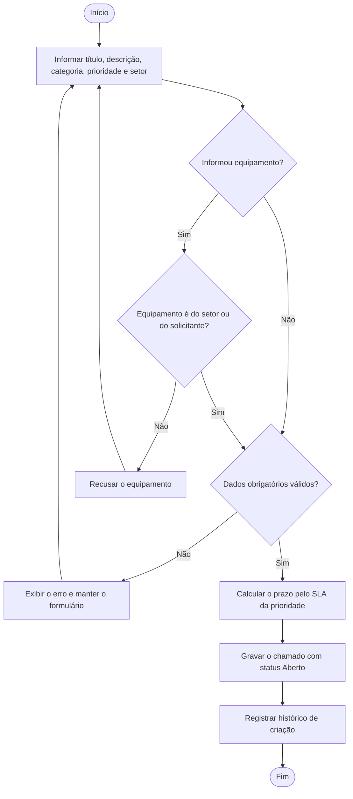
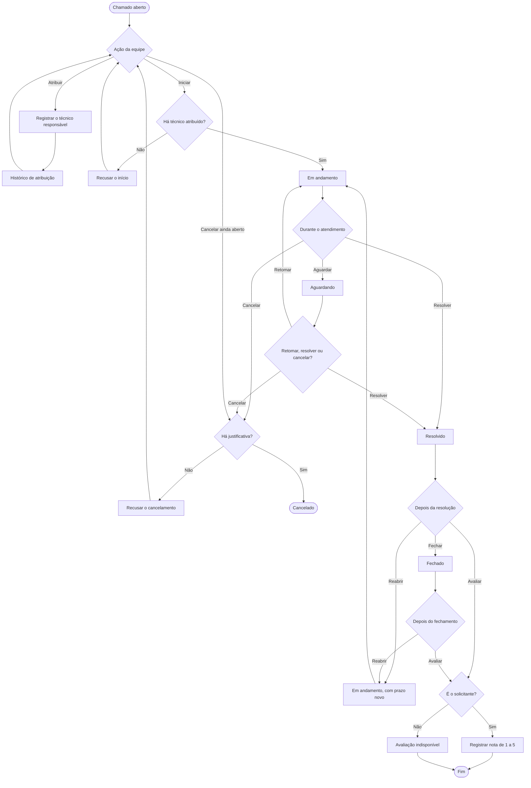
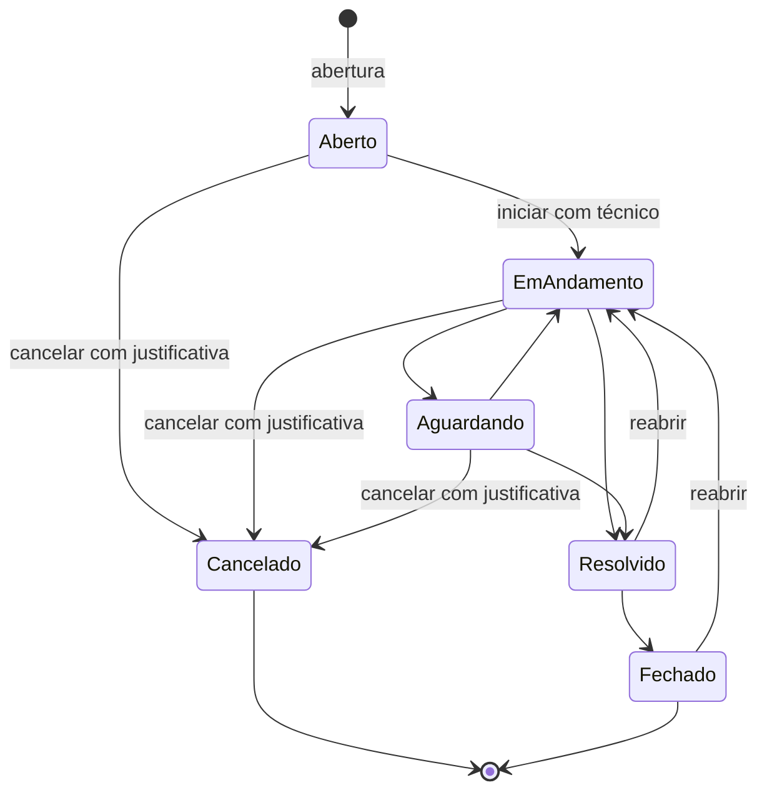

# Diagramas de atividades

Os dois fluxos centrais do chamado, mais a máquina de estados que a API realmente aceita.

## Abrir chamado

## Atender, resolver ou reabrir

Cada mudança de status, a atribuição, o cancelamento, o follow-up e a reabertura gravam histórico.

## Estados do chamado

O fluxo antigo descrevia uma fila única: Aberto, Em andamento, Aguardando, Resolvido, Fechado. A API aceita os desvios abaixo. Cancelado não reabre. Reabrir sai de Resolvido ou Fechado e volta para Em andamento.

