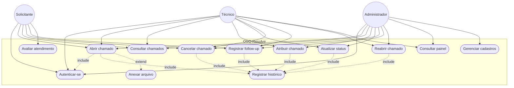

# Diagrama de casos de uso

Atores da RN09 e casos de uso que o sistema implementa. `include` é passo obrigatório. `extend` é passo opcional.

## Leitura

- Qualquer usuário autenticado abre chamado em nome próprio. O solicitante só consulta os próprios.
- Atribuir, mudar status da equipe, reabrir e o painel são do técnico e do administrador. Cadastros ficam só com o administrador.
- O solicitante altera status apenas para cancelar o próprio chamado, com justificativa, antes de resolvido ou fechado.
- Follow-up interno só aparece para técnico e administrador.
- Avaliação é só do solicitante, e só com o chamado resolvido ou fechado.
- Anexar arquivo está no modelo e no requisito, como extensão opcional da abertura. Ainda não existe rota de upload.
