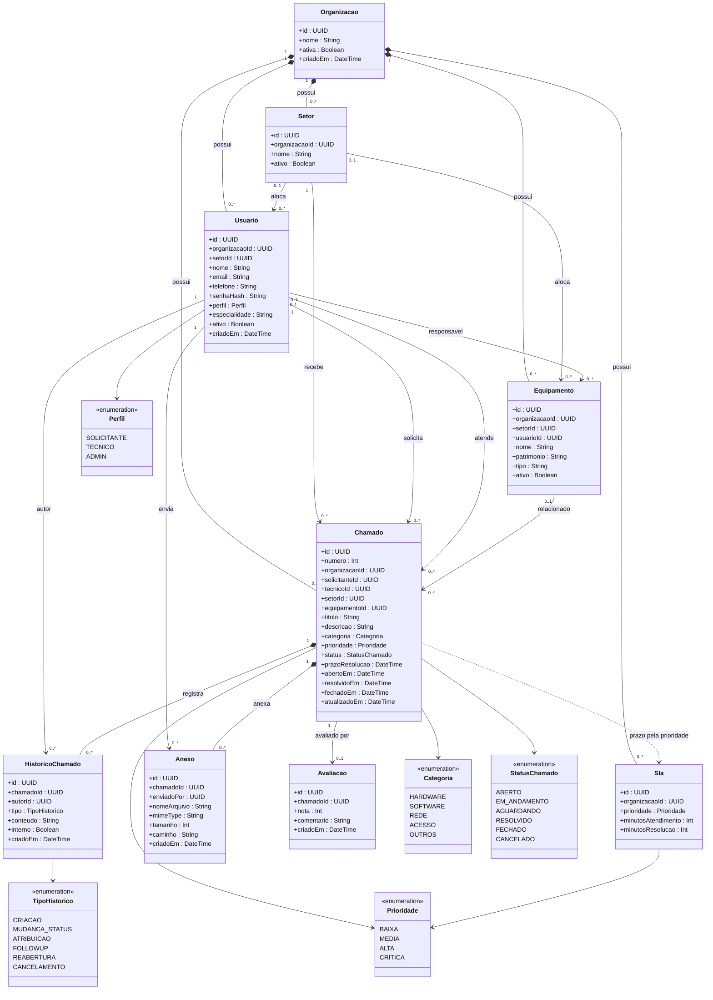

# Diagrama de classes

Modelo de domínio do OSQ-Resolve, como está em `apps/api/prisma/schema.prisma`. Técnico não é uma classe à parte: é um `Usuario` com perfil `TECNICO` e especialidade opcional. Categoria, prioridade, status e tipo de histórico são enumerações.

## Leitura

- A organização é a raiz do tenant. Setor, usuário, equipamento, chamado e SLA não existem fora dela.
- O chamado exige solicitante e setor. Técnico e equipamento são opcionais.
- Histórico e anexo são excluídos em cascata com o chamado. A avaliação é no máximo uma por chamado.
- O SLA não aponta para um chamado. Há uma configuração por prioridade em cada organização, e o prazo de resolução do chamado sai dessa configuração.
- E-mail de usuário é único dentro da organização. Nome de setor também. Avaliação é única por chamado.

Campos opcionais no banco: `Usuario.setorId`, `telefone` e `especialidade`; `Equipamento.setorId`, `usuarioId`, `patrimonio` e `tipo`; `Chamado.tecnicoId`, `equipamentoId`, `prazoResolucao`, `resolvidoEm` e `fechadoEm`; `HistoricoChamado.conteudo`; `Avaliacao.comentario`.
