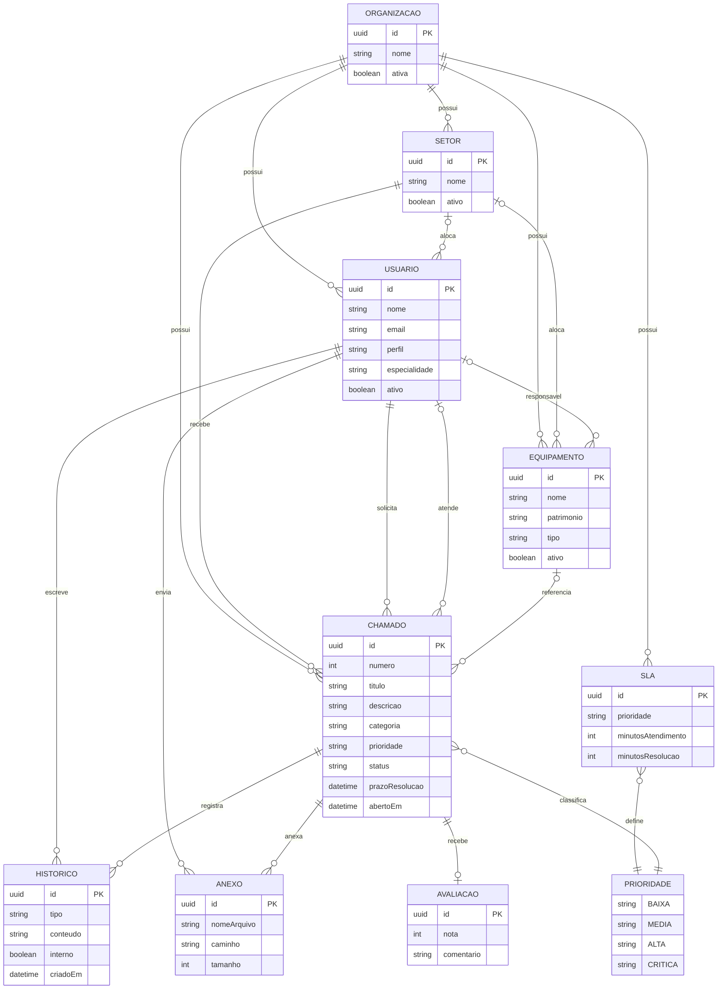

# Modelo conceitual

Entidades do `schema.prisma`. Técnico não é entidade: é um usuário com perfil `TECNICO` e especialidade opcional. Categoria, prioridade, status e tipo de histórico são enumerações, não tabelas. O SLA é uma configuração por prioridade em cada organização.

## Leitura

- A organização agrupa setor, usuário, equipamento, chamado e SLA.
- Setor do usuário e do equipamento é opcional. Setor do chamado é obrigatório.
- O chamado exige solicitante. Técnico e equipamento são opcionais.
- Há no máximo uma avaliação por chamado.
- O prazo do chamado não aponta para uma linha de SLA. Ele é calculado pela prioridade da organização.
